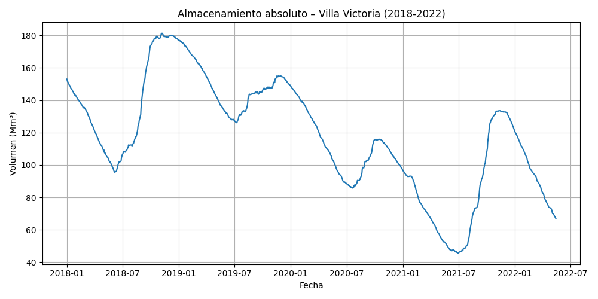
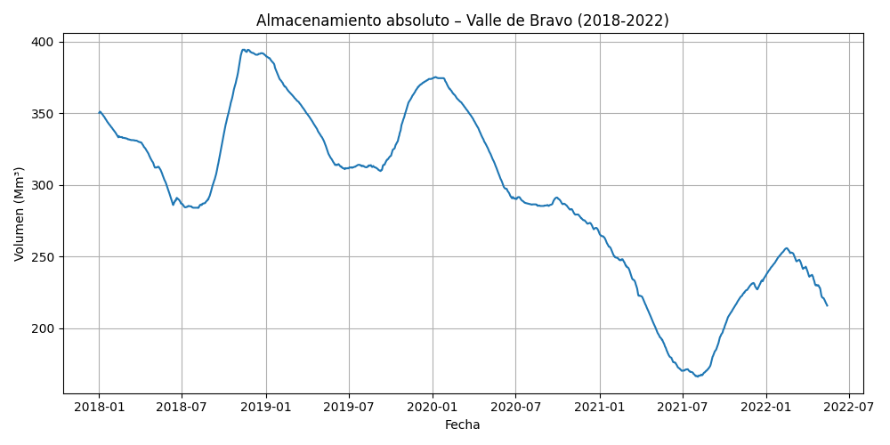
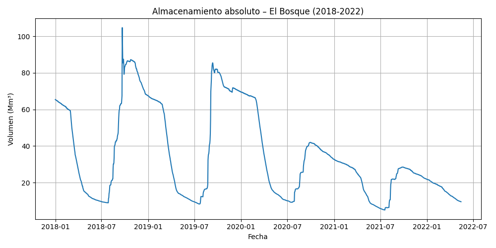
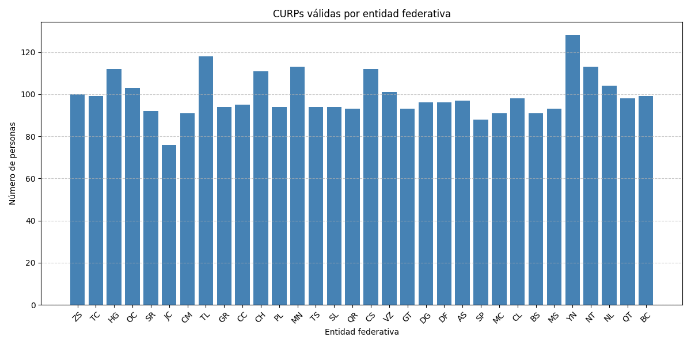

# Ejercicios

Este repositorio contiene soluciones a cinco ejercicios que abordan problemáticas ambientales, sociales y administrativas en México, con un enfoque en el uso de datos, validación estructural y análisis geoespacial.

## Estructura

- `cutzamalaSystem/`: Análisis del almacenamiento en el Sistema Cutzamala (2020–2024).
- `parkBudget/`: Distribución presupuestal propuesta para parques en la CDMX.
- `center/`: Determinación del centro geográfico de México según distintos criterios.
- `curp/`: Limpieza, validación y análisis estadístico de CURPs.
- `profeco/`: Revisión crítica del Informe Anual PROFECO 2005.

## Reporte

El reporte principal se encuentra en formato Typst (`reporte.typ`). Contiene texto, gráficas y código embebido con soporte para resaltado gracias a [`codly`](https://typst.app/universe/package/codly/). Para compilarlo necesitas tener [Typst](https://typst.app/) instalado.

### Compilación

```bash
# Instala dependencias de Python
pip install -r requirements.txt

# Genera datos para Typst (por ejemplo, para el ejercicio de CURP)
python3 curp/curp_analysis.py --typst
# grafica el almacenamiento(por ejemplo)
python3 cutzamalaSystem/plot_cutzamala.py -i 2020 -f 2024 -s
# Solo la primera vez: descarga y extrae el shapefile de Natural Earth
python3 center/generaMapa.py --first-run

# Compila el reporte
typst compile reporte.typ reporte.pdf
````

## Ejercicio 1: Sistema Cutzamala


Se analiza el almacenamiento absoluto (en millones de m³) y el porcentaje de llenado de las tres principales presas del Sistema Cutzamala: **El Bosque**, **Valle de Bravo** y **Villa Victoria**, utilizando datos históricos entre 2020 y 2024.

* Se utiliza un script en Python que descarga y procesa los datos directamente desde el FTP de CONAGUA.
* Se generan cuatro gráficas:

  * Tres gráficas individuales de almacenamiento por presa.
  * Una gráfica comparativa del porcentaje de llenado de las tres.
* Las figuras se guardan automáticamente en las carpetas `assets/` y `cutzamalaSystem/figs/`.
* También puede mostrarse cada gráfica en pantalla con la opción `-s`.

### Código relevante

Ubicado en `cutzamalaSystem/`. Uso recomendado:

```bash
# Obtener los datos desde el FTP de CONAGUA
python3 cutzamalaSystem/getDataFromSIH.py

# Generar gráficas para un rango específico
python3 cutzamalaSystem/plot_cutzamala.py -i 2020 -f 2024 -s
```

Este script acepta:

* `-i` / `--inicio`: Año inicial (ej. 2020)
* `-f` / `--fin`: Año final (ej. 2024)
* `-s` / `--show`: Muestra cada gráfica además de guardarla

> Si no se proporcionan años, el script utiliza automáticamente los últimos cuatro años disponibles en el archivo.

### 📊 Visualización de resultados

A continuación se muestran las gráficas generadas automáticamente para el periodo 2018–2022:

<div align="center">

#### Porcentaje de llenado (comparativa)


#### Almacenamiento absoluto por presa

| Villa Victoria | Valle de Bravo | El Bosque |
|:--------------:|:--------------:|:---------:|
|  |  |  |

</div>

Aquí tienes la sección correspondiente al **Ejercicio 3: Centro de México**, con el mismo estilo y nivel de detalle que tus otros ejercicios:

---

## Ejercicio 3: Centro de México


Se identifican y comparan tres localidades que afirman ser el centro de la República Mexicana: **Cañitas de Felipe Pescador** (Zacatecas), **Tequisquiapan** (Querétaro) y **Aguascalientes** (Aguascalientes). El análisis considera tres enfoques distintos: geográfico, simbólico e institucional.

* Se utiliza un script en Python que descarga y extrae automáticamente un shapefile del contorno mundial (Natural Earth), lo filtra por México y marca los tres puntos de interés.
* El mapa resultante se genera y guarda como imagen PNG en la carpeta `assets/`.
* Puede mostrarse en pantalla usando una opción adicional en la línea de comandos (`-s` / `--show`).

### Código relevante

Ubicado en `center/generaMapa.py`. Uso recomendado:

```bash
# Solo la primera vez: descarga y extrae el shapefile de Natural Earth
python3 center/generaMapa.py --first-run

# Generar el mapa y mostrarlo
python3 center/generaMapa.py --show
```

Este script acepta:

* `--first-run`: Descarga y prepara el shapefile necesario para mapear México.
* `-s` / `--show`: Muestra el mapa en pantalla además de guardarlo.
* (sin argumentos): Genera el archivo PNG en silencio como salida final.

### Visualización del resultado

El mapa generado incluye:

* **Tequisquiapan** (centro oficial designado en 1916).
* **Cañitas de Felipe Pescador** (centro geográfico según INEGI).
* **Aguascalientes** (centro simbólico señalado en la Exedra de la Plaza de la Patria).

La figura se inserta automáticamente en el reporte final de Typst para ilustrar la comparación espacial entre las distintas interpretaciones del “centro” de México.

## Ejercicio 4: Análisis de CURPs



En esta sección se valida un conjunto de CURPs contenidos en el archivo `curp_sucio.txt`, se identifican cuántas son válidas y se analiza su distribución por entidad federativa y por fechas de cumpleaños (mes y día).

* Se utiliza una expresión regular conforme a la estructura oficial publicada por RENAPO.
* Se grafica la distribución de CURPs válidas por entidad.
* Se identifican las fechas de cumpleaños (MM-DD) más frecuentes.
* Se genera automáticamente un archivo `datos.typ` si se usa la opción `--typst`.

### Código relevante

Ubicado en `curp/curp_analysis.py`. Uso recomendado:

```bash
python3 curp/curp_analysis.py --typst
```

Este script acepta:

* `--typst`: Genera `curp/datos.typ` con variables compatibles con Typst.
* `-h` o `--help`: Muestra el texto de ayuda.

## Referencias

Referencias bibliográficas y fuentes de datos se encuentran en `assets/references.yml`. Son gestionadas con [`hayagriva`](https://typst.app/docs/reference/hayagriva/), compatible con CSL YAML y `.bib`.
