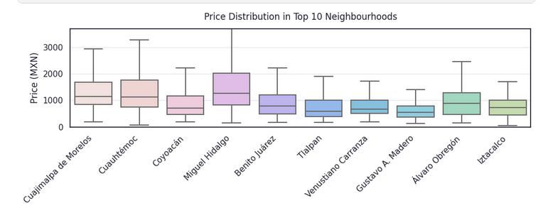

# DatosCDMX

This repository contains various data analyses addressing environmental, social, and administrative issues in Mexico, focusing on data-driven validation, structural consistency, and geospatial analysis.

## Structure

* `airbnbPrices/`: Data analysis of Airbnb listing prices in Mexico City, covering exploratory analysis, geospatial clustering, feature engineering, and predictive modeling.
* `cutzamalaSystem/`: Analysis of reservoir storage in the Cutzamala System (2020–2024).
* `parkBudget/`: Proposed budget allocation for parks in Mexico City.
* `center/`: Determination of Mexico’s geographic center using different criteria.

---

## Airbnb Prices


**Average Airbnb prices by top 10 neighbourhoods**



**Price distributionin the city 95quantile**


**Boxplot of price by room type**


**Price clusters on map**


**Heatmap correlations**


This project analyzes Airbnb listing prices in Mexico City, relating them to
geographic location, proximity to amenities, and socio-economic indicators.

**Dataset**: `airbnb_cdmx_2024_data.csv` located in `data/` folder, including
features such as price, room type, neighbourhood, distances to services
(supermarket, hospital, subway, park, university, restaurant), and
socio-economic indices (income per month, average cost of living, demand index,
security index).

**Objectives**:

- Perform exploratory data analysis to characterize price distribution across
  neighbourhoods and room types.
- Identify price clusters and hotspots using geographic clustering
  (Folium/GeoPandas).
- Engineer features (log-price, price categories, distances to points of
  interest, socio-economic interactions).
- Build and evaluate predictive models (lR,Ridge) to estimate listing prices.


## How to run

```bash
# Install core dependencies
pip install pandas numpy matplotlib folium geopandas scikit-learn xgboost branca

# Install and register Jupyter kernel
pip install --user ipykernel
python3 -m ipykernel install --user --name datosCDMX --display-name "Python 3.13.3 (datosCDMX)"
```
```
```

## Interactive Map with Folium

You can create an interactive hexbin-like map using Folium and your Catppuccin
Mocha palette. This map shows average prices per grid cell and allows
panning/zooming in the browser.

```python
import numpy as np
import matplotlib.pyplot as plt
import folium
from branca.colormap import LinearColormap

# 1. Compute hexbin grid off-screen
fig, ax = plt.subplots()
hb = ax.hexbin(
    df['longitude'], df['latitude'],
    C=df['price'], gridsize=50,
    reduce_C_function=np.mean,
    mincnt=1
)
plt.close(fig)

# 2. Extract centers and averages
centers = hb.get_offsets()
avgs    = hb.get_array()

# 3. Build Folium map
m = folium.Map(location=[19.43, -99.13], zoom_start=11, tiles='CartoDB positron')

# 4. Create Catppuccin colormap
colormap = LinearColormap(
    colors=catppuccin_mocha,
    vmin=avgs.min(),
    vmax=avgs.max(),
    caption='Avg Price (MXN)'
)

# 5. Plot hex proxies as circles
hex_radius = 400  # meters
for (lon, lat), avg in zip(centers, avgs):
    folium.Circle(
        location=(lat, lon),
        radius=hex_radius,
        fill=True,
        fill_color=colormap(avg),
        color=None,
        fill_opacity=0.6,
        weight=0
    ).add_to(m)

# 6. Add legend and display
colormap.add_to(m)
m
```

This approach leverages Matplotlib’s `hexbin` to compute bins and Folium’s `Circle` layers for an interactive map. Adjust `gridsize` and `hex_radius` to fine-tune visual density, and enjoy a fully interactive, Catppuccin-themed spatial analysis of Airbnb prices.


### Usage

You can alter the notebook in `/pricesAirbnb/` o ir al siguiente link en [Kaggle](https://www.kaggle.com/code/leonz9/airbnb-prices-cdmx-anal/edit).

---

## Cutzamala System


This analysis covers the absolute storage volume (in millions of m³) and fill percentage of the three main reservoirs in the Cutzamala System: **El Bosque**, **Valle de Bravo**, and **Villa Victoria**, using historical data from 2020 to 2024.

* A Python script downloads and processes data directly from the CONAGUA FTP server.
* Four plots are generated:

  * Individual storage charts for each reservoir.
  * A comparative fill-percentage chart for all three.
* Figures are saved automatically to `assets/` and `cutzamalaSystem/figs/`.
* Use the `-s` flag to display each plot on-screen.

### Usage

```bash
# Download data from CONAGUA FTP
python3 cutzamalaSystem/getDataFromSIH.py
# Generate plots for a specific range
default usage: last four available years
python3 cutzamalaSystem/plot_cutzamala.py -i 2020 -f 2024 -s
```

* `-i, --inicio`: Start year (e.g., 2020).
* `-f, --fin`: End year (e.g., 2024).
* `-s, --show`: Display plots in addition to saving.

---

## Exercise 3: Geographic Center of Mexico


We compare three sites claiming to be Mexico’s center: **Cañitas de Felipe Pescador** (Zacatecas), **Tequisquiapan** (Querétaro), and **Aguascalientes** (Aguascalientes). The analysis uses three different approaches: geographic, symbolic, and institutional.

* A Python script downloads and filters the Natural Earth shapefile for Mexico, then plots the three points of interest.
* The resulting map is saved as a PNG in `assets/`.
* Use the `-s`/`--show` flag to display the map on-screen.

### Usage

```bash
# First-time setup: download and prepare the shapefile
python3 center/generaMapa.py --first-run

# Generate and display the map
python3 center/generaMapa.py --show
```

* `--first-run`: Download and prepare the shapefile.
* `-s, --show`: Display the map on-screen.

---
